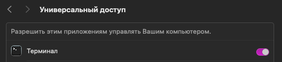

Команды для запуска и отладки выполняем в отдельных вкладках терминала (Cmd + T). Перед началом убедись, что окружение настроено по инструкции из [`docs/SETUP_GUIDE.md`](SETUP_GUIDE.md)

> Разработчик использовал команду `cd /Users/a1111/Desktop/projects/Telegrambot` для локального запуска — подставь свой путь к проекту

## 🎯 Выбор способа запуска

**Вариант 1: Без Docker** (требует установленный Swift на Mac)  
**Вариант 2: С Docker** (рекомендуется, окружение как на сервере)

Выбери один из вариантов и следуй инструкциям ниже. Шаги 1-5 общие для обоих вариантов.

---

## Общие шаги (для обоих вариантов)

0. **Проверь Docker (только для варианта с Docker)**

> ⚠️ **Для варианта без Docker:** Пропусти этот шаг и переходи к шагу 1

Если выбрал вариант с Docker, проверь что Docker Desktop запущен:

```bash
docker ps
```

**Если видишь ошибку "Cannot connect to the Docker daemon":**
- Docker Desktop не запущен — открой его из Applications
- Подожди 10-20 секунд после запуска Docker Desktop, пока daemon полностью загрузится
- Проверь снова: `docker ps`

> 💡 **Автозапуск Docker Desktop:** В настройках Docker Desktop (Preferences → General) можно включить "Start Docker Desktop when you log in" — тогда Docker будет запускаться автоматически при перезагрузке Mac. Если эта опция выключена, нужно запускать Docker Desktop вручную после каждой перезагрузки.

---

1. **Создай первую вкладку (Cmd + T) и запусти NGINX**

> 💡 **Зачем нужен NGINX:** NGINX работает как reverse proxy на порту 8080, проксируя запросы на разные Docker-сервисы по путям (например, `/nowcontroller/webhook` → порт 8084). Это позволяет использовать один ngrok URL для всех ботов, не меняя порт при переключении между сервисами.

NGINX нужен для обоих вариантов запуска. Это делаем один раз; `brew services` ставит его в автозапуск, и после перезагрузки nginx поднимается сам:

- Первый запуск (если ранее не поднимали через Homebrew):
```bash
brew services start nginx
  ```

- Если ты уже запускал NGINX ранее, можешь проверить состояние сервиса:
  - Проверить статус:
    ```bash
    brew services list | grep nginx
    ```
    Пример ожидаемого вывода:
    ```
    nginx       started         a1111 ~/Library/LaunchAgents/homebrew.mxcl.nginx.plist
    ```
  - Или перезапустить при необходимости:
```bash
    brew services restart nginx
    ```

- Проверь, что NGINX слушает порт 8080:
  ```bash
  curl -s http://127.0.0.1:8080/ | head -n 3
  ```
  Если видишь HTML — NGINX работает. После этого команду можно не повторять до следующей настройки

- Останови, если требуется:
```bash
  brew services stop nginx
```


2. **Проверь VPN:** включи его и убедись, что соединение работает:
(Если видишь российский IP — то VPN НЕ работает, включи VPN и проверь снова!)

```bash
curl -s https://api.ipify.org
```


3. **Создай вторую вкладку (Cmd + T) и запусти ngrok:**

(Скопируй URL из логов — строка "Forwarding https://xxxxx-xxxxx-xxxxx.ngrok-free.app -> http://localhost:8080")

> 💡 **Важно:** Всегда используй `ngrok http 8080` — это порт nginx, который проксирует запросы на все Docker-сервисы. Один ngrok URL будет работать для всех ботов.

⚠️ Важно: ngrok для пользователей из России запускается только в терминале с включённым VPN. URL будет стабильным неделями, но если ты перезапустиim ngrock то выдаваемый тебе для Тестов URL изменится

⚠️ Если видишь ошибку ERR_NGROK_9040 — VPN НЕ работает, включи VPN и запусти ngrok снова!
(Эта вкладка должна оставаться открытой — ngrok работает постоянно)

```bash
ngrok http 8080 --log=stdout
```


4. **Обнови BASE_URL:** вставь URL в секретный файл config/.env на строку BASE_URL=https://xxxxx-xxxxx-xxxxx.ngrok-free.app (ориентируйся на шаблон `docs/env.example` для структуры файла)
(Можно закрыть редактор после сохранения)


5. **Создай третью вкладку (Cmd + T),** загрузи переменные окружения и настрой webhook'и:

Проверка: если видишь все токены — всё ок
Эту вкладку можно закрыть после выполнения скрипта — webhook'и настроены

```bash
cd /Users/a1111/Desktop/projects/Telegrambot
set -a; source config/.env; set +a
env | grep -E 'FILENOWBOT_TOKEN|NOWCONTROLLERBOT_TOKEN|VIDEO_BOT_TOKEN|GOLOSNOWBOT_TOKEN|NEURFOTOBOT_TOKEN|ANTISPAMNOWBOT_TOKEN|CONTENTFABRIKABOT_TOKEN|PERESKAZNOWBOT_TOKEN|PERESKAZ_OPENAI_SERVICE'
./config/set-webhooks.sh
```


6. **Запусти сервисы** — выбери один из вариантов ниже

---

## 🚀 Вариант 1: Запуск без Docker

> ⚠️ **Требования:** Установленный Swift на Mac (проверь: `swift --version`)

**Вариант А: Автоматический запуск всех MVP ботов (рекомендуется)**

Скрипт автоматически откроет новые вкладки в Terminal.app и запустит все сервисы с правильной последовательностью (NowControllerBot первым для инициализации БД):

> ⚠️ **При первом запуске скрипта:** macOS попросит разрешение на управление Terminal.app. Нажми "Разрешить" в системном диалоге, иначе скрипт не сможет открывать новые вкладки



```bash
cd /Users/a1111/Desktop/projects/Telegrambot
./config/start-all-services.sh
```

Скрипт проверит наличие токенов в `config/.env` и запустит только те сервисы, для которых токены установлены. Каждый сервис запустится в отдельной вкладке с задержкой 2 секунды между открытием вкладок.

**Вариант Б: Ручной запуск (каждый сервис в новой вкладке через Cmd + T)**

> ⚠️ **При первом запуске после клонирования репозитория:** 
> Рекомендуется сначала запустить `NowControllerBot` для автоматической инициализации базы данных монетизации (`config/monetization.sqlite`) и создания записей для всех ботов из `NOWCONTROLLERBOT_BROADCAST_BOTS=`. После этого можно запускать остальные сервисы в любом порядке. База данных создастся автоматически при запуске любого сервиса, но инициализация записей для ботов происходит только в `NowControllerBot`

- NowControllerBot — управление отправкой сообщений в боты NowBots и включение-выключение проверки на подписку каналов-спонсоров
  ```bash
  cd /Users/a1111/Desktop/projects/Telegrambot
  set -a; source config/.env; set +a
  swift run NowControllerBot
  ```

- VideoServiceRunner — основной обработчик Roundsvideobot
  ```bash
  cd /Users/a1111/Desktop/projects/Telegrambot
  set -a; source config/.env; set +a
  LOG_LEVEL=debug swift run VideoServiceRunner
  ```
  > 💡 **Mini-app и кэш:** Мини-апп в Telegram — это веб-страница по URL; WebView кэширует JS/CSS. Если меняешь `app.js` или `styles.css`, перед деплоем увеличивай `?v=` в `Roundsvideobot/VideoService/Public/index.html`, иначе в проде может показываться старая версия. Подробнее: [`docs/archive/ROUNDSVIDEOBOT_MINIAPP_CACHE_FIX.md`](archive/ROUNDSVIDEOBOT_MINIAPP_CACHE_FIX.md).

- FileNowBot — скачивание TikTok без водяного знака
  ```bash
  cd /Users/a1111/Desktop/projects/Telegrambot
  set -a; source config/.env; set +a
  swift run FileNowBot
  ```

- GolosNowBot — голос в текст (SaluteSpeech)
  ```bash
  cd /Users/a1111/Desktop/projects/Telegrambot
  set -a; source config/.env; set +a
  swift run GolosNowBot
  ```

- ContentFabrikaBot — генерация постов для Telegram каналов в стиле автора
  ```bash
  cd /Users/a1111/Desktop/projects/Telegrambot
  set -a; source config/.env; set +a
  swift run ContentFabrikaBot
  ```

- Neurfotobot — бот для нейрофотографий (AI обработка изображений)
  ```bash
  cd /Users/a1111/Desktop/projects/Telegrambot
  set -a; source config/.env; set +a
  swift run Neurfotobot
  ```

- PereskazNowBot - бот для получения расшифровки и саммари YouTube видео через OpenAI Whisper API и GPT
  ```bash
  cd /Users/a1111/Desktop/projects/Telegrambot
  set -a; source config/.env; set +a
  swift run PereskazNowBot
  ```

- AntispamNowBot — антиспам бот: выключатель на ночь, капча для вступления, запрещатель сообщений от каналов (в разработке)
  ```bash
  cd /Users/a1111/Desktop/projects/Telegrambot
  set -a; source config/.env; set +a
  swift run AntispamNowBot
  ```

- NeurVideoBot — бот для генерации видео сервисами OpenAI, Google и другими (в разработке)
  ```bash
  cd /Users/a1111/Desktop/projects/Telegrambot
  set -a; source config/.env; set +a
  swift run NeurVideoBot
  ```

- GolosNowBot — озвучивает пересланный текст голосом (в разработке)
  ```bash
  cd /Users/a1111/Desktop/projects/Telegrambot
  set -a; source config/.env; set +a
  swift run GolosNowBot
  ```

  
  **Требования:**
  - `PERESKAZNOWBOT_TOKEN` - токен бота от @BotFather
  - `PERESKAZ_OPENAI_SERVICE` - OpenAI API ключ для Whisper API и GPT
  - `yt-dlp` - установлен через `brew install yt-dlp`
  - `ffmpeg` - установлен через `brew install ffmpeg` (для сжатия больших аудио файлов)
  
  **Ограничения:**
  - Максимальная длительность видео: 1 час
  - Не более 1 ссылки в минуту
  - Не более 20 видео в день на пользователя


> Подробный план настройки GolosNowBot с ключами и сертификатами см. в [golosnowbot/README.md](../golosnowbot/README.md).
### Дополнение: быстрая настройка GolosNowBot

Если поднимаешь golosnowbot впервые, выполни один раз:

```bash
mkdir -p config/certs
openssl s_client -showcerts \
  -servername ngw.devices.sberbank.ru \
  -connect ngw.devices.sberbank.ru:9443 </dev/null 2>/dev/null \
  | awk '/BEGIN CERTIFICATE/,/END CERTIFICATE/' \
  > config/certs/salutespeech-chain.pem
```

Убедись, что в `config/.env` заполнены `GOLOSNOWBOT_TOKEN`, `SALUTESPEECH_AUTH_KEY`, `SALUTESPEECH_SCOPE`, `BASE_URL`.  
Webhook для бота: `https://<BASE_URL>/golosnow/webhook`


7. Проверочные команды — см. [docs/VERIFY.md](./VERIFY.md). Запускай их в отдельной вкладке (Cmd + T) и закрывай после завершения тестов


8. Зайди в @botfather, выбери активные боты (например, @roundsvideobot), открой "Bot settings" → "Menu button", нажми "Configure menu button" и вставь актуальный URL из ngrok


Вкладки, которые можно закрыть сразу после выполнения команды:
- Первая вкладка (шаг 1): nginx запущен как сервис — после запуска не требуется удерживать вкладку (`brew services` управляет в фоне)
- Третья вкладка (шаг 5): настройка вебхуков — закрывай после выполнения скрипта

Вкладки, которые держим открытыми постоянно для локальной отладки:
- Вторая вкладка (шаг 3): ngrok с внешним VPN — держи открытой постоянно и не закрывай, пока работаешь

Вкладки с сервисами (оставляй открытыми, если запускаешь соответствующий бот):
- Четвёртая вкладка (шаг 6): VideoServiceRunner (Roundsvideobot) — основной сервис формирования видеокружков
- Пятая вкладка (шаг 6): FileNowBot — загрузка TikTok без водяного знака
- Шестая вкладка (шаг 6): GolosNowBot — распознавание голосовых через SaluteSpeech
- Седьмая вкладка (шаг 6): ContentFabrikaBot — генерация постов для Telegram каналов в стиле автора
- Восьмая вкладка (шаг 6): Neurfotobot — нейрофотографии (AI обработка изображений)
- Девятая вкладка (шаг 6): AntispamNowBot — антиспам бот: выключатель на ночь, капча для вступления, запрещатель сообщений от каналов (в разработке)
- Десятая вкладка (шаг 6): NeurVideoBot — генерация видео сервисами OpenAI, Google и другими (в разработке)
- Двенадцатая вкладка (шаг 6): PereskazNowBot — получение расшифровки и саммари YouTube видео через OpenAI Whisper API и GPT
- Тринадцатая вкладка (шаг 6): NowControllerBot — управление отправкой сообщений в боты NowBots (MVP)

Обычно активно несколько вкладок: ngrok (обязательно), NowControllerBot (тоже обязательно), сервисы, которые ты запускаешь самостоятельно

---

## 🐳 Вариант 2: Запуск с Docker (рекомендуется)

> ✅ **Преимущества:** Окружение идентично серверу (Linux), нет проблем с различиями macOS/Linux

> ⚠️ **Требования:** Установленный Docker (проверь: `docker --version`)

### Подготовка (один раз)

Создай временные папки, если их ещё нет:

```bash
cd /Users/a1111/Desktop/projects/Telegrambot
mkdir -p Roundsvideobot/Resources/temporaryvideoFiles
mkdir -p Neurfotobot/tmp
```

### Запуск сервисов

**Вариант А: Запустить один сервис для отладки**

```bash
cd /Users/a1111/Desktop/projects/Telegrambot

# Запустить один сервис (например, Neurfotobot)
docker compose -f docker-compose.dev.yml up neurfotobot

# Или другой сервис:
# docker compose -f docker-compose.dev.yml up filenowbot
# docker compose -f docker-compose.dev.yml up contentfabrikabot
# docker compose -f docker-compose.dev.yml up golosnowbot
# docker compose -f docker-compose.dev.yml up pereskaznowbot
# docker compose -f docker-compose.dev.yml up roundsvideobot
# docker compose -f docker-compose.dev.yml up nowcontrollerbot
```

**Вариант Б: Запустить все сервисы сразу**

```bash
cd /Users/a1111/Desktop/projects/Telegrambot
docker compose -f docker-compose.dev.yml up
```

**Вариант В: Запустить в фоне (detached mode)**

```bash
cd /Users/a1111/Desktop/projects/Telegrambot
docker compose -f docker-compose.dev.yml up -d
```

### Полезные команды для Docker

```bash
# Просмотр логов конкретного сервиса
docker compose -f docker-compose.dev.yml logs -f neurfotobot

# Просмотр логов всех сервисов
docker compose -f docker-compose.dev.yml logs -f

# Перезапустить один сервис (после изменения кода)
docker compose -f docker-compose.dev.yml restart neurfotobot

# Остановить все сервисы
docker compose -f docker-compose.dev.yml down

# Пересобрать образ (если изменился Dockerfile или Package.swift)
docker compose -f docker-compose.dev.yml build --no-cache neurfotobot
```

### Важные моменты для Docker варианта

- **Код редактируешь на Mac** в IDE как обычно — изменения видны сразу через volumes
- **NGINX обязателен** — работает как reverse proxy на порту 8080, проксируя запросы на Docker-сервисы по путям
- **ngrok всегда на порт 8080** — один URL для всех ботов, не нужно менять при переключении сервисов
- **После изменения кода** перезапусти контейнер: `docker compose -f docker-compose.dev.yml restart <service>`
- **Конфиг nginx:** `/opt/homebrew/etc/nginx/nginx.conf` — уже настроен для всех сервисов

> 💡 Подробнее о разработке в Docker см. [docs/DEVELOPMENT.md](DEVELOPMENT.md)

---

## 📝 Общие шаги (продолжение)

7. **Проверочные команды** — см. [docs/VERIFY.md](./VERIFY.md). Запускай их в отдельной вкладке (Cmd + T) и закрывай после завершения тестов

8. **Зайди в @botfather**, выбери активные боты (например, @roundsvideobot), открой "Bot settings" → "Menu button", нажми "Configure menu button" и вставь актуальный URL из ngrok

---

## 📋 Управление вкладками

**Вкладки, которые можно закрыть сразу после выполнения команды:**
- Первая вкладка (шаг 1): nginx запущен как сервис — после запуска не требуется удерживать вкладку (`brew services` управляет в фоне) — **только для варианта без Docker**
- Третья вкладка (шаг 5): настройка вебхуков — закрывай после выполнения скрипта

**Вкладки, которые держим открытыми постоянно для локальной отладки:**
- Вторая вкладка (шаг 3): ngrok с внешним VPN — держи открытой постоянно и не закрывай, пока работаешь

**Вкладки с сервисами (оставляй открытыми, если запускаешь соответствующий бот):**
- VideoServiceRunner (Roundsvideobot) — порт 8081
- FileNowBot — порт 8085
- GolosNowBot — порт 8083
- ContentFabrikaBot — порт 8089
- Neurfotobot — порт 8082
- PereskazNowBot — порт 8090
- NowControllerBot — порт 8084 (обязательно запускать первым для инициализации БД)

Обычно активно несколько вкладок: ngrok (обязательно), NowControllerBot (тоже обязательно), сервисы, которые ты запускаешь самостоятельно
